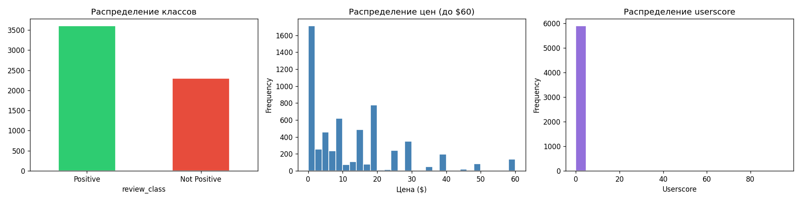
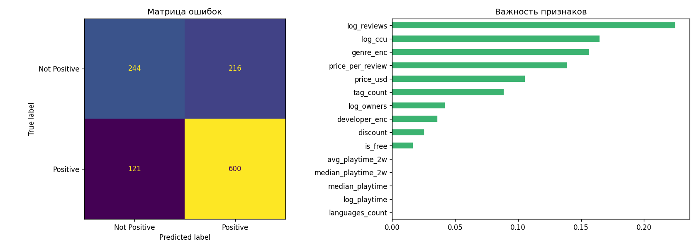

# Steam Games Review Score Dataset

## Описание

Датасет собран через публичный API SteamSpy (steamspy.com) в мае 2026 года.
Содержит информацию о 5903 играх из магазина Steam.
Задача: классификация — предсказать, будет ли игра положительно
оценена пользователями (Positive vs Not Positive).

## Примеры визуализаций

## Структура файла steam\_games.csv

|Колонка|Тип|Описание|
|-|-|-|
|appid|int|Уникальный ID игры в Steam|
|name|str|Название игры|
|developer|str|Разработчик|
|publisher|str|Издатель|
|price\_usd|float|Цена в долларах США|
|discount|int|Текущая скидка (%)|
|languages\_count|int|Количество поддерживаемых языков|
|positive|int|Количество положительных отзывов|
|negative|int|Количество отрицательных отзывов|
|total\_reviews|int|Общее количество отзывов|
|review\_ratio|float|Доля положительных отзывов (0.0–1.0)|
|avg\_playtime|int|Среднее время игры (минуты)|
|median\_playtime|int|Медианное время игры (минуты)|
|peak\_ccu|int|Пиковый онлайн (одновременных игроков)|
|review\_class|str|Класс отзывов (Positive/Not Positive)|
|genre|str|Топ-3 тега по голосам пользователей|
|tag\_count|int|Общее количество тегов у игры|
|userscore|int|Оценка SteamSpy (0–100)|
|owners\_min|int|Нижняя граница числа владельцев|
|avg\_playtime\_2w|int|Среднее время за последние 2 недели (мин)|
|median\_playtime\_2w|int|Медианное время за последние 2 недели (мин)|

## Целевая переменная

review\_class → бинаризована: Positive (review\_ratio >= 0.8) vs Not Positive

## Источник данных

* API: https://steamspy.com/api.php?request=all\&page=N
* Без авторизации, публичный доступ
* Собрано постранично (1000 игр/страница, 6 страниц)
* Отфильтрованы игры с менее чем 10 отзывами

## Требования

pandas
scikit-learn
numpy
matplotlib

## Воспроизведение

1. Запустить ячейку Парсер для сбора данных (\~1 мин)
2. Запустить Импорт библиотек
3. Запустить Пример данных для EDA
4. Запустить Baseline для обучения модели

## Результаты baseline-модели

* Модель: RandomForestClassifier (300 деревьев, max\_depth=15)
* Accuracy: 0.715
* F1 (weighted): 0.707
* Positive class F1: 0.78

